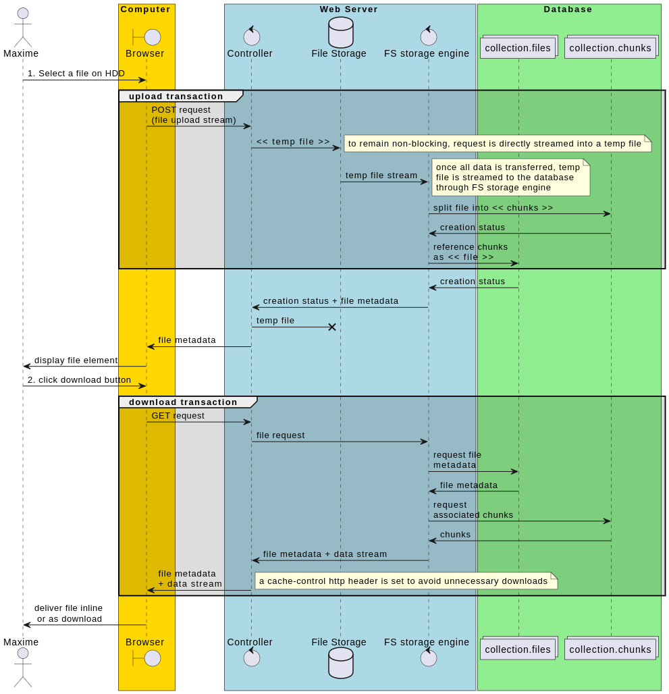

# meteor-mongo-files

## Introduction

A Meteor library to make file uploading and managing as easy as possible. It offers a consistent and resilient file storage strategy, relying on busboy, mongodb and gridFS. The files are stored in MongoDB. The package is very lightweight (~25kB minified) and has only busboy as direct dependency.

### What problem does it solve ?

Keeping consistency in a file management system is not an easy task. Why not integrate the files directly with the rest of the data ?

### Benefits

- keep all your data in one place
- is capable of incredible scaling
- If your application is on the same network as your database, latency will be lower than with a remote storage solution like AWS S3.
- It will lower data transfer costs if you use a self-managed MongoDB instance.

### Drawbacks

- It will increase overall costs if you use a managed DBaaS like Atlas.)
- If you deal with a lot of big files, it will not perform as well as object storage.

### 2 strategies

Files can either be stored in their entirety (as MongoDB documents) or chunked by GridFS. In this second case, GridFS creates 2 collections : "collection.files" and "collection.chunks", which makes it possible to reconstitute the files.
Let's evaluate which approach is better for your use case. Using one document per file seems simpler, but it also has a few disadvantages :

- a MongoDB document is limited to 16Mb
- if you store a file directly as a document, it cannot be streamed directly to the database. Hence the file will be temporarily loaded entirely into the memory which may lead to a decrease in overall performance.

So this approach is generally preferred if you have a lot of small files or if you need low latency (even if it means increasing performance costs)

And when it comes to GridFS, you can store files of unlimited size and files can be directly streamed from the DB to the client, but :

- it will use more storage because additional information is stored within each chunk
- it will need more processing power.

So this approach is generally preferred if you have fewer but larger files

## Install

```bash
npm install --save meteor-mongo-files
```

## Simple usage (CRUD)

```js
// anywhere in Meteor server

import { WebApp } from 'meteor/webapp';
import { meteorMongoFiles, Buckets } from 'meteor-mongo-files';

const [parseDocumentData, downloadDocument] = meteorMongoFiles({
  bucketName: 'documents',  // as you can see, most of the configuration is done internally.
});

WebApp.connectHandlers.use('/api/documents', async (req, res, next) => {
  switch (req.method) {
    case 'POST':
      const saveDocumentToDB = await parseDocumentData(req);
      await saveDocumentToDB(); break;
    case 'GET':
      downloadDocument(req, res); break;
    case 'PATCH':
      Buckets.documents.rename(req.body.id, req.body.new_name);
      res.end(204); break;
    case 'DELETE'
      Buckets.documents.delete(req.body.id);  // where "documents" is our bucket name
      res.end(204); break;
  }
});
```

As you may have noticed, for renaming and deleting we can directly rely on [GridFSBucket](https://mongodb.github.io/node-mongodb-native/4.8/classes/GridFSBucket.html).

### Options

`meteorMongoFiles(options)`
| Attribute | Type | Default value | Description
|---|---|---|---|
| BucketName | string | 'documents' | name of the bucket/collection that MeteorMongoFiles will create |
| gridFS | boolean | true | defines whether GridFS engine will be used or not |
| db | Db (MongoDB native) | default Meteor MongoDB instance | MongoDB instance|
| generateFileId | function | `Random.id()` | a function to generate a custom MongoDB \_id |

### Example of requests

```js
// POST
const formData = new FormData();
formData.append('ressource_id', data._id);
formData.append('ressource_type', 'contact');
formData.append('file', file);
formData.append('filename', file.name); // filename is sent separately because utf-8 encoding will be lost

await axios.post('/api/documents', formData);
```

```js
// GET
const res = await axios.get(
  `/api/documents?id=${fileId}&download=false`),
);
```

If download query param is true, it will trigger a download.
It it's set to false, the file will be opened in the browser (provided that its format is supported)

```html
<!-- inline -->


<!-- download -->
<a
	href="https://yourwebsite.domain/api/documents?id=FpPJxvmN8gDnKSiqp&download=true"
	>Download</a
>
```

## The whole picture (GridFS enabled)



## License

MIT © [jonisapp](https://github.com/jonisapp)
